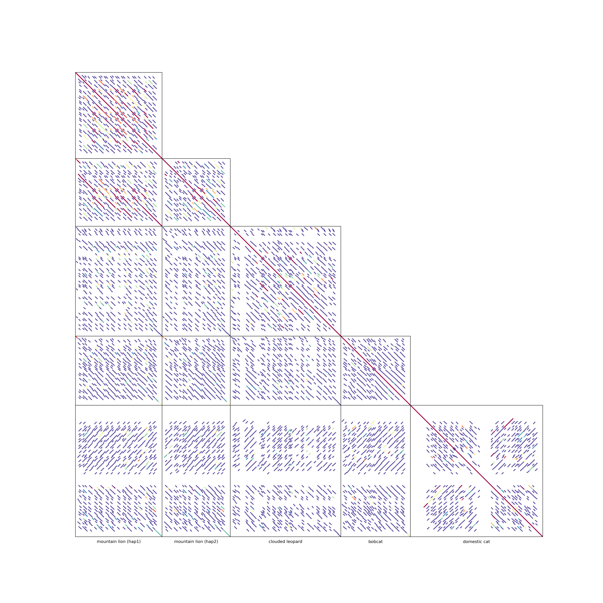

# PatchWorkPlot
A tool for visualization of pairwise alignments of multiple sequences as [dot plots](https://en.wikipedia.org/wiki/Dot_plot_(bioinformatics)) arranged into an upper or lower triangular matrix.

## Dependencies
- [Pandas](https://anaconda.org/anaconda/pandas)
- [BioPython](https://anaconda.org/conda-forge/biopython)
- [LASTZ](https://anaconda.org/bioconda/lastz) / [YASS](https://anaconda.org/bioconda/yass) / [minimap2](https://anaconda.org/bioconda/minimap2) / [MashMap](https://github.com/marbl/MashMap) or custom aligner

## Input Parameters
### Required parameters
`-i INPUT_CONFIG.CSV` or `-i INPUT_CONFIG.TSV`: a configuration file containing information about input sequences in the CSV/TSV format. The configuration file contains the following columns:
- `SampleID`: a unique identifier of each sequence (required).
- `Fasta`: a complete path to each sequence in FASTA format (required).
- `Label`: labels will be used in the output plot and, unlike SampleIDs, do not have to be unique to a sequence and can be empty (required).
- `Annotation`: a complete path to annotation in [BED format](https://genome.ucsc.edu/FAQ/FAQformat.html#format1) (optional).
- `Strand`: an orientation of the sequence with respect to the first one. Values can be `+` and `-` (optional).
  
An example of the configuration file can be found in `test_dataset/config_example.csv`.

`-o OUTPUR_DIR`: the name of the output directory. If the directory does not exist, it will be created.

### Optional parameters
`--aligner NAME`: the name of a tool used for pairwise alignment sequences. `lastz` (LASTZ), `yass` (YASS), `minimap2` (minimap2), `mashmap` (mashmap) options are available. Default: `lastz`. Custom aligner option is described in paragraph `Usage` further.
`--minimap2-params "PARAMS"`: default minimap2 parameters are set as `--secondary=yes -P -k 10 -w 5 --no-long-join -r 100 -g 50`. Custom minimiap2 parameters can be set with this argument. 
`--mashmap-params "PARAMS"`: default mashmap parameters are set as `--pi 70`
`--cmap NAME`: the name of a coloring map used for visualization of alignments. The minimum and maximum values of percent identity thresholds (`min-pi` and `max-pi`) will be used to determine the color of the alignment: 
- Alignments with percent identity below `min-pi` will be shown using the leftmost color in the coloring cmap.
- Alignments with percent identity above `max-pi` will be shown using the rightmost color in the coloring map.
- Alignments with percent identity between `min-pi` and `max-pi` will be projected onto the coloring map and colored accordingly.
  
For the list of available coloring maps, please refer to the [Matplotlib documentation](https://matplotlib.org/stable/users/explain/colors/colormaps.html). Default: `Spectral`.

`--reverse-cmap BOOLEAN`: if `true`, then `min-pi` and `max-pi` values of the percent identities will correspond to the rightmost and leftmost colors of the coloring map, respectively. In the case of `Spectral` map, alignments with high and low percent identity will be colored in red and blue, respectively. Default: `true`.  

`--color STRING`: alignments will be colored in the specified color. The value can be a color name (e.g., `black`) or a HEX code (e.g., `#000000`). If both `--color` and `--cmap` are specified, then the `--color` option will be used. 

`--min-pi FLOAT`: the alignment percent identity value that will be used to determine the color of the least similar alignments. Default: `85`.

`--max-pi FLOAT`: the alignment percent identity value that will be used to determine the color of the most similar alignments. Default: `100`.

`--min-len INT`: only alignments of lengths exceeding `min-len` will be visualized. Default: `5000`.

`--lwidth INT`: the width of lines showing alignments on the final plot. Default: `1`. 

`--lower`: if specified, alignments will be visualized as a lower triangular matrix instead of an upper triangular matrix. 

`--show-annot`: if specified, annotations will be extracted from `INPUT_CONFIG.CSV` (column `Annotation`) and shown on the side of the plot. 

`--hide-legend`: if `true`, then the legend will not be added to the plot. 

`--show-bp`: show horisontal line of alignment breakpoints. 

`--bp-color #COLOR`: color of breakpoint lines. Default is `#7F7F7F` (grey).  

`--bp-min-len INT`: minimum length of the alignment to frame with lines. Default is `10000`. 

`--bp-lwidth INT`: the width of lines framing the alignemnt breakpoints. Default is `0.2`. 

`--transparent`: if specified, the .PNG version of the plot will have a transparent background.  

`--help / -h`: print help.

### Default values of parameters
Default values of input parameters are stored in `default_params.txt`. It covers the parameters described above as well as the parameters of LASTZ alignments. The file can be modified to change the default values and avoid passing the arguments through the arguments of the command line. Minimap2 default parameters can be passed as an argument `--minimap2-params`; however, not recommended. Mashmap parameters can be passed with `--masmap-params`.   

## Usage
An example of visualization of a lower-triangular patchwork plot using the `PuBuGn` coloring map (the direct orientation) with an increased line width and without gene positions: 

`python PatchWorkPlot.py -i input_config.csv -o patchwork_output --cmap PuBuGn --reverse-cmap false --lwidth 2 --lower`

Please note that the pairwise alignment is the most time-consuming step. If you want to change visualization of previously aligned sequences, you can rerun PatchWorkPlot specifying the existing output directory through `-o` and changing the desired visualization parameters. E.g.: the command line:

`python PatchWorkPlot.py -i input_config.csv -o patchwork_output --cmap jet --reverse-cmap false --min-len 10000 --show-annot`

will use alignments in the `patchwork_output` direcitory and modify the patchworkplot by: 
- changing the coloring map to `jet`,
- discarding alignments shorter than 10 kbp,
- using the default parameter to draw lines, 
- showing gene positions,
- reporting an upper triangular matrix. 

### Visualization of IgDetective results
PatchWorkPlot is useful to visualize highly repetitive sequences or sequences with a high density of structural variations such as immunoglobulin (IG) and T-cell receptor (TCR) loci. A script `generate_igdetective_config.py` simplifies analysis of adaptive immune loci annotated using the IgDetective tool and generates a config file that can be used as an input to PatchWorkPlot. To run the script, use the following command line:

`python generate_igdetective_config.py PATHS_TO_IGDETECTIVE_DIRS LOCUS OUTPUT_DIR`

where:
- `PATHS_TO_IGDETECTIVE_DIRS` is a space- or comma-separated paths to output directories of IgDetective. If the paths are separated by spaces, make sure to put them in double quotes: `"PATH_1 PATH_2 ... PATH_N"`.
- `LOCUS`: a type of adaptive immune locus for which the config will be generated. Available options are `IGH, IGK, IGL, TRA, TRB, TRG`.
- `OUTPUT_DIR`: the name of the output directory. If the directory does not exist, it will be created.

#### Example of joint usage of IgDetective & PatchWorkPlot 
The directory [`test_dataset`](test_dataset) includes five IgDetective directories containing results of IG/TR locus annotation for five cat genomes: 
- `test_dataset/01_mPumCon1.1_hap1_igdetective`: the mountain lion (_Puma concolor_), haplotype 1, accession: GCA_028749985.3.
- `test_dataset/02_mPumCon1.1_hap2_igdetective`: the mountain lion (_Puma concolor_), haplotype 2, accession: GCA_028749965.3.
- `test_dataset/03_mNeoNeb1_igdetective`: the clouded leopard (_Neofelis nebulosa_), accession: GCA_028018385.1.
- `test_dataset/04_mLynRuf1_igdetective`: the bobcat (_Lynx rufus_), accession: GCF_022079265.1.
- `test_dataset/05_mFelCat1_igdetective`: the domestic cat (_Felis catus_), accession: .

The following command lines generates a configuration file for immunoglobulin heavy chain (IGH) loci and converts IGH gene files to BED format:

`python generate_igdetective_config.py "test_dataset/01_mPumCon1.1_hap1_igdetective test_dataset/02_mPumCon1.1_hap2_igdetective test_dataset/03_mNeoNeb1_igdetective test_dataset/04_mLynRuf1_igdetective test_dataset/05_mFelCat1_igdetective" IGH cats_IGH_configuration`

Then, PatchWorkPlot takes the compiled configuration file and visualizes pairwise alignments of the IGH loci. The `--show-annot` option is used to illustrate positions of IGH genes predicted by IgDetective: 

`python PatchWorkPlot.py -i cats_IGH_configuration/config.csv -o cats_IGH_patchworkplot --show-annot`

### Visualization of custom alignments
PatchWorkPlot offers an option of providing custom alignment files. Alignments files are stored in the folder `OUTPUT_FOLDER/pairwise_alignments/`. Each file is named as one of the patterns: a) `self_NAME1.tsv` b) `pair_NAME1_NAME2.tsv`. Please note that name also contains an ordered index (based on the order in the configuration input file, as example: `INDEX-SAMPLEID` | `0-mPumCon1.1_hap1`), and is identical to the `SampleID` name provided in the input configuration file. 

I. User can provide the `.tsv` files with columns [`#name1`, `strand1`, `start1`, `end1`, `length1`, `name2`, `strand2`, `start2+`, `end2+`, `length2`, `id%`]; files' named according to the description. 

II. Majority of the alignment tools provide `.paf` output files. Using PatchWorkPlot `generate_alignment_files.py`, it is possible to create alignment files with a proper naming and column structure automatically. 

`python generate_alignment_files.py PAF_CONFIG.CSV/TSV OUTPUT_DIR`

The custom `PAF_CONFIG.CSV` file should contain columns `name1`, `name2`, `pafPath`; thus the simple structure denoted 2 alignment IDs and a path to a corresponding `.paf` file. 

## Gallery
| Annotation | Upper triangle                                                                                         | Lower triangle                                                                             |
| ----|--------------------------------------------------------------------------------------------------------|--------------------------------------------------------------------------------------------|
| No annotation |                          |              |
| Parameters | `default`                                                                                              | `--lwidth 3 --min-len 20000 --lower --min-pi 80 --max-pi 95 --skip-legend`                 |
| With annotation |                                |                    |
| Parameters | `--show-annot --lwidth 2 --min-len 10000 --cmap Greens --reverse-cmap false --min-pi 80 --skip-legend` | `--show-annot --lower --lwidth 2 --min-len 15000 --cmap viridis --min-pi 75 --skip-legend` |

## Citation
Pospelova M, Safonova Y. PatchWorkPlot: simultaneous visualization of local alignments across multiple sequences. arXiv. 2025. https://arxiv.org/abs/2503.20766.
